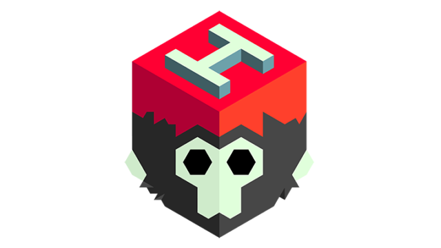

# Eliminate Fobid-21 🦠

Este proyecto es un juego estilo Shoot ´em up/Bullet hell que se realizo con la finalidad de conscientizar a la poblacion hispanohablante acerca de las vacunas contra la situacion que estamos enfrentando actualmente. Se intenta mostrar de forma interactiva y caricaturesca los beneficios que una vacuna puede tener para que las personas tengan menos miedo y puedan asi subir sus probabilidades de no verse altamente afectados por la pandemia. Además se busca recaudar un poco del profit para donarlo a organizaciones que ayuden a combatir el la situación o apoyen a familias afectadas por la misma.

### Pre-requisitos 📋

Se necesita contar con un celular android con un sistema operativo minimo 4.4 y maximo de 11.0, además de contar con el espacio de memoria suficiente.

### Instalación 🔧

Paso 1.- Vaya a su aplicación de Play Store.

Paso 2.- Escriba el nombre del juego, Eliminate Fobid-21. Busque el icono del juego y presionelo.

Paso 3.- Presione en instalar y espere a que se descargue y posteriormente se instale.

Paso 4.- ¡Disfrute del juego!

## Construido con 🛠️

_Menciona las herramientas que utilizaste para crear tu proyecto_

* [Unity](http://www.unity.com) - Motor de videojuego
* [Marmoset](https://marmoset.co/hexels/) - Herramienta para pixelart

## Autores ✒️

* **Guillermo Drew Barragán** - *Absolutamente todo* - [HellAngeal](https://github.com/HellAngeal)

## Licencia 📄

Este proyecto está bajo la Licencia HellAngeal.

## Como se realizo ⚙️

Se utilizo Unity como motor de juego para la creación de los scripts e incorporacion de animaciones, necesarias para que el juego pudiese funcionar de manera correcta.

Unity Ads fue requerido para la adición de un banner que se estará mostrando para adquirir revenue de este juego. El juego contara con una unica transacción opcional para remover el banner. Esta transacción costara 2 dolares, de los cuales la mitad se donará a fundaciones que ayuden a combatir el covid. 

Por ultimo se utilizo Marmoset Hexels para realizar todo el apartado artistico (pixelart).

## Gameplay 🚀

Shoot ´em up/Bullet hell donde se utilizará el acelerometro para mover nuestra vacuna y se podra utilizar toda la pantalla para tocar y realizar un disparo. Los enemigos apareceran desde arriba y vendra de forma decendente disparandote, tendras que esquivar tanto las balas como a los enemigos. La dificultad del juego aumentará conforme más tiempo pase y más puntos tengas, pero también los enemigos tendrán una posibilidad de tirarte dos tipos de mejoras para ayudarte a progresar de manera más sencilla. La mejora de disparo tendra forma de un glóbulo blanco y hara que dispares más balas y la mejora única sera distinta para cada tipo de vacuna y mejorara algo en específico para esa vacuna. En el mvp creado solo se tendrá una vacuna y su mejora única es el aumento de velocidad base. Los niveles de ataque son 5 contando el inicial y de la mejora única serán solo 2 y comenzará en 0. Cuando se reciba daño ambos niveles seren reseteados a sus valores iniciales y además cuando se reciba daño 5 veces el juego terminará. 

## Expresiones de Gratitud 🎁

*Gracias al profe por hacer que me desvele haciendo el proyecto, que si me gusto y seguiré trabajando en vacaciones.

---
⌨️ con odio hacia todos por [HellAngeal](https://github.com/HellAngeal) 😊
