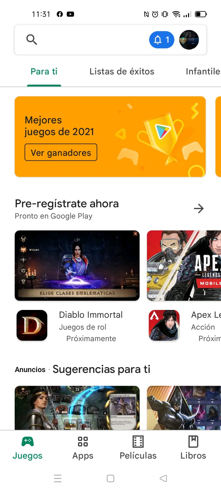
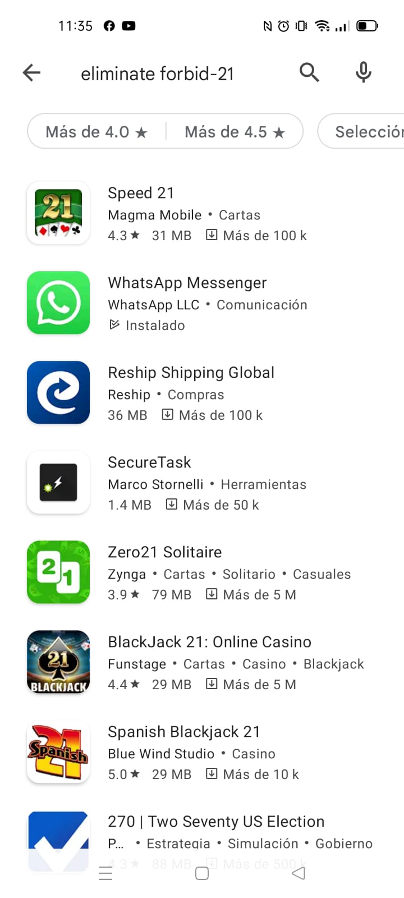
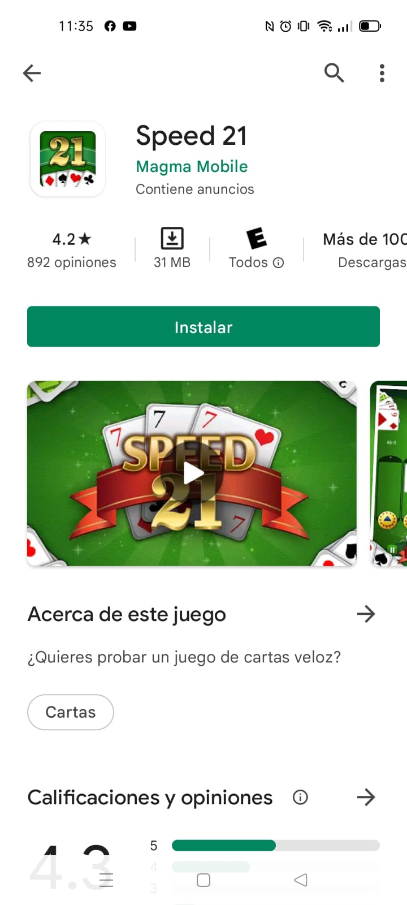

# Título del Proyecto

_Acá va un párrafo que describa lo que es el proyecto_

## Comenzando 🚀

_Estas instrucciones te permitirán obtener una copia del proyecto en funcionamiento en tu máquina local para propósitos de desarrollo y pruebas._

Mira **Deployment** para conocer como desplegar el proyecto.

### Pre-requisitos 📋

Se necesita contar con un celular android con un sistema operativo minimo 4.4 y maximo de 11.0, además de contar con el espacio de memoria suficiente.

### Instalación 🔧

Paso 1.- Vaya a su aplicación de Play Store.

Paso 2.- Escriba el nombre del juego, Eliminate Fobid-21. Busque el icono del juego y presionelo.

Paso 3.- Presione en instalar y espere a que se descargue y posteriormente se instale.

Paso 4.- ¡Disfrute del juego!

## Construido con 🛠️

_Menciona las herramientas que utilizaste para crear tu proyecto_

* [Unity](http://www.unity.com) - Motor de videojuego
* [Marmoset](https://marmoset.co/hexels/) - Herramienta para pixelart

## Autores ✒️

_Menciona a todos aquellos que ayudaron a levantar el proyecto desde sus inicios_

* **Andrés Villanueva** - *Trabajo Inicial* - [villanuevand](https://github.com/villanuevand)
* **Fulanito Detal** - *Documentación* - [fulanitodetal](#fulanito-de-tal)

También puedes mirar la lista de todos los [contribuyentes](https://github.com/your/project/contributors) quíenes han participado en este proyecto. 

## Licencia 📄

Este proyecto está bajo la Licencia (Tu Licencia) - mira el archivo [LICENSE.md](LICENSE.md) para detalles

## Como se realizo ⚙️

Se utilizo Unity como motor de juego para la creación de los scripts e incorporacion de animaciones, necesarias para que el juego pudiese funcionar de manera correcta.

Unity Ads fue requerido para la adición de un banner que se estará mostrando para adquirir revenue de este juego. El juego contara con una unica transacción opcional para remover el banner. Esta transacción costara 2 dolares, de los cuales la mitad se donará a fundaciones que ayuden a combatir el covid. 

## Expresiones de Gratitud 🎁

* Comenta a otros sobre este proyecto 📢
* Invita una cerveza 🍺 o un café ☕ a alguien del equipo. 
* Da las gracias públicamente 🤓.
* etc.

---
⌨️ con ❤️ por [Villanuevand](https://github.com/Villanuevand) 😊